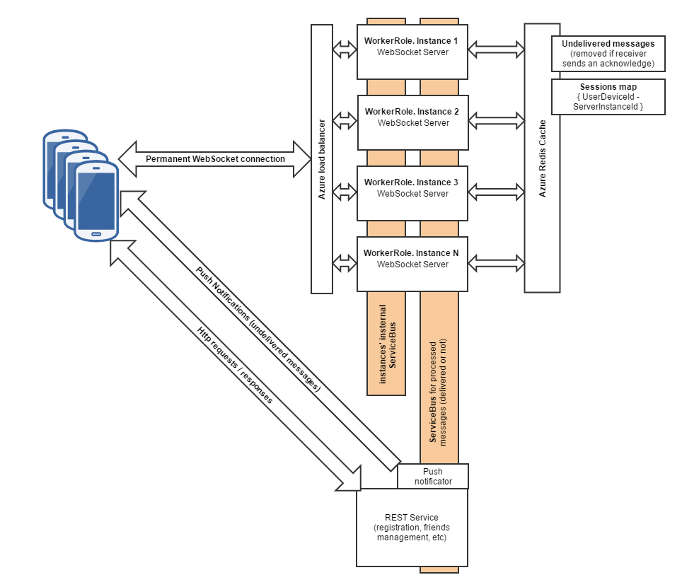

KinderChat
===========

KinderChat is a sample application that we presented at Microsoft Build 2015 in April of 2015.

The goal of this application is to provide a secure chat application for children, where
all the communications between children are encrypted and yet, provides a golden key to
parents to monitor the communications of their children.

This application is born out two simple principles.   The first one is that if a children 
has nothing to hide, he has nothing to fear.  And the second one is that parents must
trust but verify. 

By allowing parents to monitor the conversation of their children with third parties, we can 
ensure their safety and a more harmonious future for everyone.

User Experience
---------------

The individual clients are written using native code for Android, iOS and Windows.  They should
provide a good blue print for how to build native user experiences while sharing code across
all those platforms.

Cryptography and Onboarding Experience
--------------------------------------

At the core of Kinder Chat lives a secure cryptographic system.   It is as secure as we could
design it, and could probably be improved by security and cryptographic experts, we welcome your
input.

We have tried to solve the problem of onboarding users and yet, provide a secure communication
system.   

Each time you run an instance of Kinder Chat a new private/public key pair is generated.  The
private key never leaves your device, is never posted to the web and is never recorded on the
Kinder Chat servers.   Instead, the public key is sent to the servers, and users are then able
to merge one or more endpoints into a single identity.

For example, the identity "Miguel de Icaza" associated with the phone, 555-555-5555 and the
email address miguel@thekinderchat.im would have many public keys associated with it, one
for each device that completes the verification process.   

Consider this scenario, Jose and Maria are the parents of Jesus, and Magdalena is a close 
friends of his.  

When Magdalena wants to send a message to Jesus, her Kinder Chat application will retrieve
from the server all the keys that are associated with Jesus.   That will for example include
the Jesus' iPhone key, and the Jesus' Android key, and also the keys for the Jesus' parents,
Maria and Jose.  

So if Maria sends the message "Sup yo", KinderChat will encrypt that message using four
different keys, one for each recipient (two of them are Jesus' different devices, and 
one for each parent in this case).   Then the messages are posted to the server and stored
in the respective buckets.   Then the client KinderChat apps for Jesus, Maria and Jose
will retrieve those copies and decrypt the results on each device.

This has some important side effects: if you change devices, or delete and reinstall the
application on a device, new keys will be generated.  This means that you could never
decipher any previous messages stored.   Your device becomes your key.

Kinder Points
-------------

To ensure that kids use the application for all their communication, a system of points was
introduced, one where the more the kids use the application.   Points are earned for using
the application, or by eating their veggies, or completing chores.

In-App purchases [*] allow children to purchase Kinder Points from their allowance, this 
empowers children to increase their Kinder Point scores on weeks where they have not 
performed their chores, ate their veggies or used the application enough.  This teaches
kids a valuable civics lesson: that everything is for sale, for the right price.

[*] This feature is not yet available in this public release.

Platforms
---------

The code contains clients for Android, iOS and Windows 10.   It contains a watchOS app for
parents to grant points.

The Matriarch app is a Windows desktop application dashboard that centralizes the management
and statistics for the activities performed by their offspring.

Backend
-------

We are hoping that no child will be left behind, that is, we want every kid in the world to
use this safe and secure system, so we have designed the backend to scale.   

The backend is built on top of Azure, and uses several Azure services to scale up.  It uses
the ServiceBus to connect the frontends to the backing stores.

This diagram shows the high-level architecture:

Status
------

We build this code for about a month before the Build conference took place, and had not
really had the time to work on this since then.  While we like the user experience that 
we got up to the time of the release, the design language and idioms have evolved from
April, and if we had time, we would likely refresh some elements.

There is a lot of room for improvement on the backend and how to scale it, but we have not
really touched the code since the conference.

This project originally had a different name and a different target audience, our delay
to release the code was due to the need we had to remove the traces of the original name.

We might release the other project if we manage to replace the branding and artwork on it.
